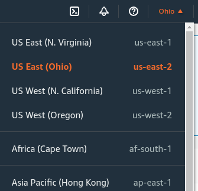

# Project Description

The purpose of this project is to create a database for storing data related to crimes that occurred in Boston. 

The objectives for this database are:

- Create a database ```crimes_db``` with a table ```boston_crimes``` with appropriate data types
- Create a schema and create the table inside it
- Loading the data from ```boston.csv``` in the table
- Create readonly and readwrite groups with appropriate privileges
- Create users for each of the groups

The desired end result would look like:


# Dataset

The dataset is 

# Setup

## Postgres Database on Amazon RDS

Start AWS and navigate to the AWS management console [here](https://console.aws.amazon.com/console/).

Under all AWS services, locate Database > RDS:


Now that we're within the RDS console, let's create a PostgreSQL DB instance.

First, select a region on the top right corner. I chose US-east. You can choose whichever region you prefer.




## Terminating Resources


