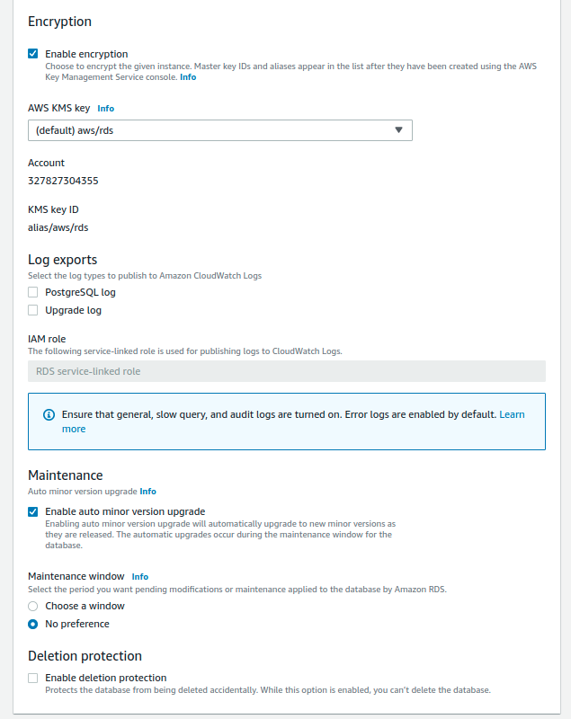

# Project Description

The purpose of this project is to create a database for storing data related to crimes that occurred in Boston. 

The objectives for this database are:

- Create a database ```crimes_db``` with a table ```boston_crimes``` with appropriate data types
- Create a schema and create the table inside it
- Loading the data from ```boston.csv``` in the table
- Create readonly and readwrite groups with appropriate privileges
- Create users for each of the groups

The desired end result would look like:


# Dataset

The dataset consists of information about all crimes in the Boston area from 2015 to 2018. The columns include:

- Incident number - unique value 
- offense_code - unique code specific to crime comitted
- description - description of crime comitted
- data - data of crime comitted
- day_of_the_week - day of the week the crime was comitted
- lat - latitude of the location where the crime was comitted
- long - longitude of the location where the crime was comitted

# Setup

To build the database table, I created a postgres instance on AWS RDS.

## Postgres Database on Amazon RDS

Start AWS and navigate to the AWS management console [here](https://console.aws.amazon.com/console/).

Under all AWS services, locate Database > RDS:


Now that we're within the RDS console, let's create a PostgreSQL DB instance.

First, select a region on the top right corner. I chose US-east. You can choose whichever region you prefer.


Find the 'Create database' section and create a database.


Select 'Standard create' and 'PostgreSQL', 'Free tier'


Now with the new window open, choose a unique name for the DB Instance identifier, a master username and a master password.


Under Instance configuration, select the db.t3.micro class, 20 GB of storage on general purpose SSD. Unselect the 'Enable storage autoscaling'.


Under 'Connectivity', choose 'Default VPC' for VPC, 'default' subnet group, 'yes' to Public access, 'Create new' to VPC security group firewall. Provide a name for the VPC security group with no preference for the availability zone.


Under 'Additional configuration', I changed the Backup retention period to 1 day since I didn't need to backup for this project. 


Under 'Encryption', make sure encryption is enabled and disable deletion protection. This makes deleting the database simple at the end of the project.



Once complete, proceed to database creation. You'll see this box shown below on your screen and it will take a few minutes for the database creation.


Once complete, you can find the 'Endpoint & Port' information which is used to connect to the database for the creation of the tables in this project.


## Terminating Resources

Upon completion of the project, the database resource was terminated by selecting the resource, and choosing 'Delete' under the 'Actions' tab. 


